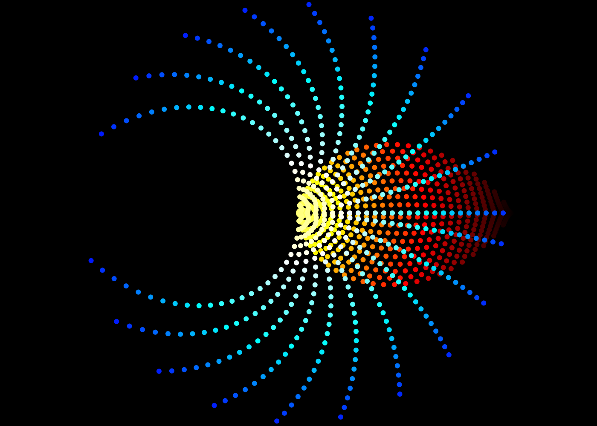
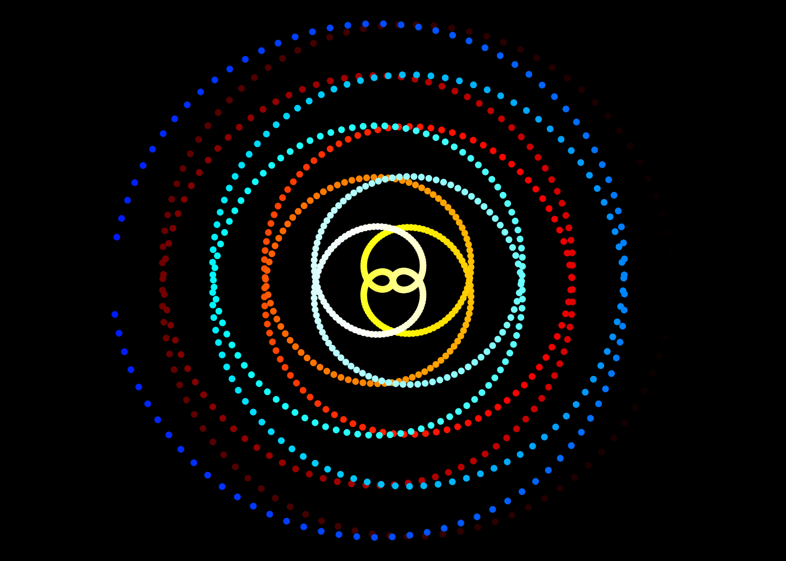
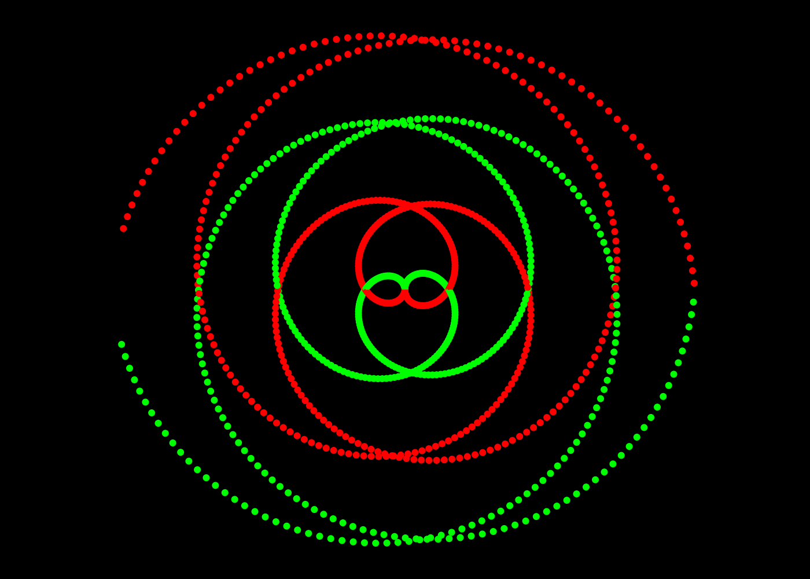
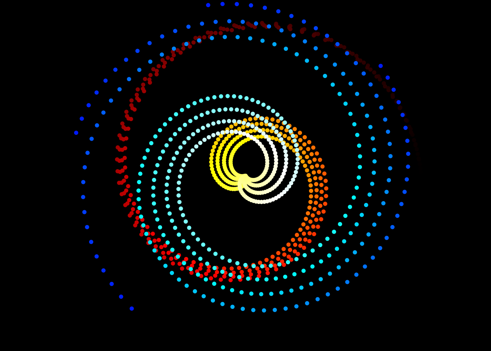
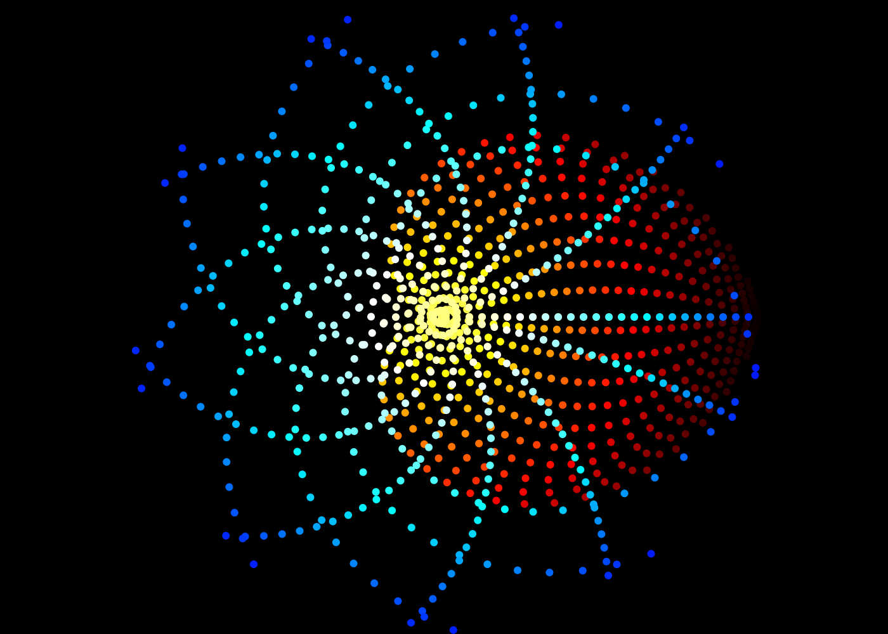
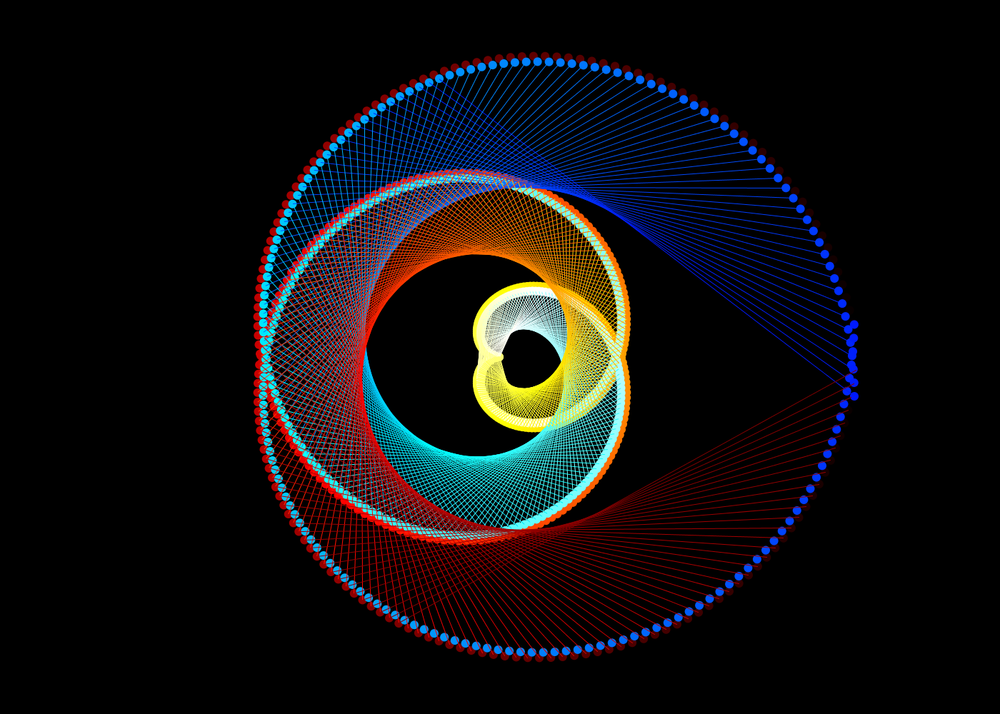
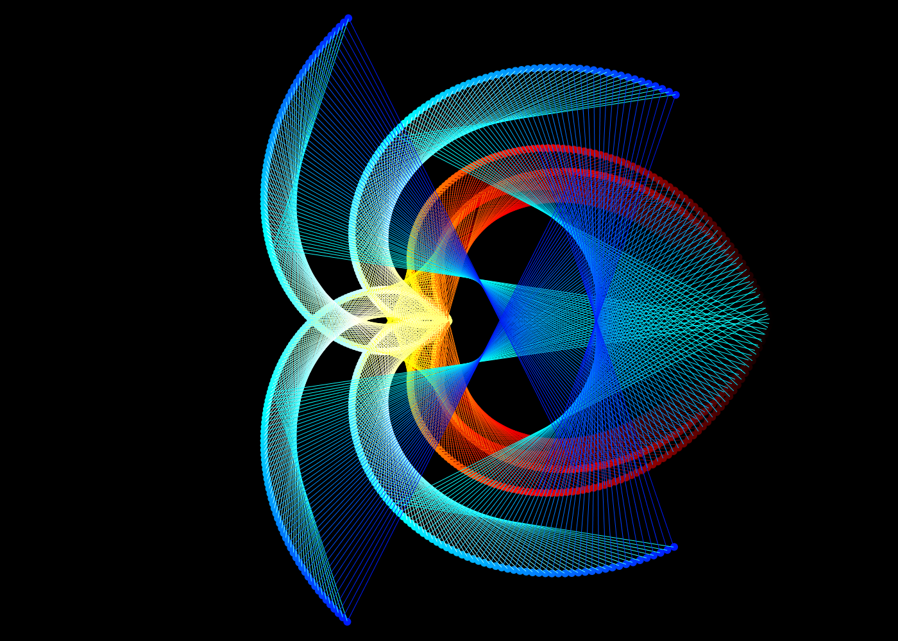
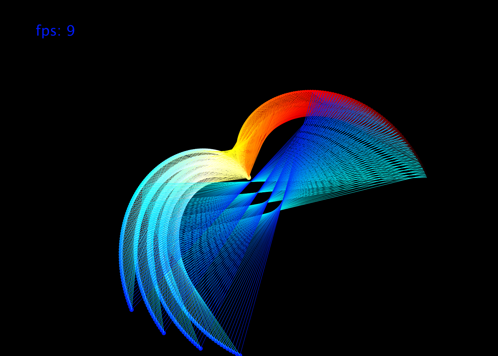
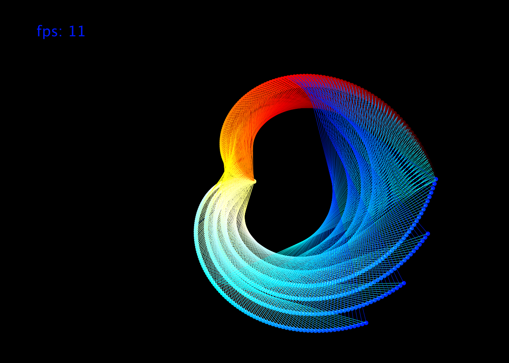

# surprising_spinning_balls
Who knew spinning balls at different speeds could produce such interesting results?

# Spinning balls at different (mostly increasing) speeds:
|   |   |
| ------------- | ------------- |
|   |   |
|   |   |

# What if we added lines to connect the balls?:

 

[comment]: <> (![]&#40;output/cool_picture0440.png&#41;)

[comment]: <> (![]&#40;output/cool_picture0862.png&#41;)

